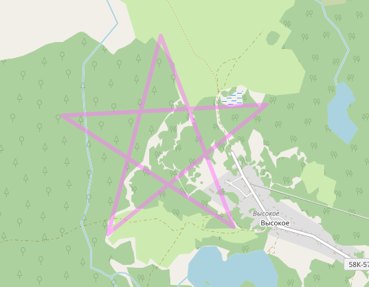

Скрипт рисует трек в виде пятиконечной звезды, имея одной вершин заданную точку 
<p align="center">
    
</p>

```
usage: makestar.py [-h] [-a ANGLE] [-d DISTANCE] -s lat lon [-o OUT]

create gpx track as STAR

optional arguments:
  -h, --help            show this help message and exit
  -a ANGLE, --angle ANGLE
                        star slope in degrees, default 195 degree
  -d DISTANCE, --distance DISTANCE
                        star side length in meters, default 150 meters
  -s lat lon, --start lat lon
                        First point of star, e.g. 56.31841 30.54227
  -o OUT, --out OUT     Filename for track
```

Задание точи единственный аргмент. Остальные опциональные.

Угол 195 градусов даст привычно расположенную звёздочку с исходной точкой в северной вершине.

Перед использованием имеет смысл задать собственный путь для сохранения файлов

Пример содания нескольких звёздочек
```
for a in \`seq 0 30 270\`; do ./makestar.py -a $a -d 250 -s 58.29000 31.33000; done
```
